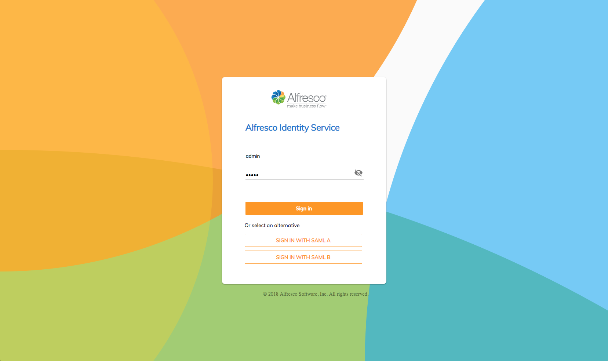

# Alfresco Keycloak Theme

[](https://travis-ci.com/Alfresco/alfresco-keycloak-theme)

## Overview

The [Alfresco Identity Service](https://github.com/Alfresco/alfresco-identity-service) uses [Keycloak](https://www.keycloak.org/).  Out of the box, the UI provided by Keycloak is 
quite different from the rest of Alfresco.  But Keycloak allows a customer to provide alternative themes to replace the default
Keycloak themes.  We use this mechanism to provide an Alfresco theme.

## Design

The following themes can be replaced.
 
* login
* account
* email
* admin 
 
This projects contains a theme that can be used to replace the login theme to provide
an experience that is consistent with Alfresco.  

Several approaches are possible.  
1. **Extend the existing themes**.  With this approach, a copy of the default theme is made and selective
edits are made to the theme.  For example, different style sheets can be
used but otherwise the layout provide by Keycloak could stay the same.
2. **Use ADF**.  With this approach, the ADF component is used directly, effectively making Keycloak 
an ADF app.
3. **Custom login page**.  With this approach, a page is provided that uses the same approved Alfresco
styles.

This project currently uses the approach of a custom login page (option #3).

## Implementation

Since Keycloak supports Freemarker, [a template file](./theme/login/login.ftl) is provided along with 
[css styles](./theme/login/resources/css/login.css) and [images](./theme/login/resources/img) like those documented to look like the [approved designs](https://app.zeplin.io/project/57d69ef9c8a62bb604985525/screen/5a4dfb3c92a348c3fbe1c586)

The project also includes improvements to the translated messages for the languages supported by Alfresco.

## Deployment of the Theme Files

### Deployment with the Alfresco Identity Service
If you deploy the Alfresco Identity Service as
described [here](https://github.com/Alfresco/alfresco-identity-service), the Alfresco Keycloak Theme is 
deployed automatically.   

### Deployment to a standalone Keycloak server
1. After installing Keycloak, navigate to the themes directory as in e.g.
```
 ~/development/keycloak-10.0.2/themes
 ```
2. Create a directory named *Alfresco*.  
3. Copy the *login* directory from this project to a *login* directory in the Alfresco theme directory you 
just created
4. Start Keycloak

### Deployment to a Keycloak server running in a Kubernetes cluster
1. Find the name of the pod in which the cluster is running 
```
kubectl get pods

... erstwhile-rabbit-key-0  1/1  Running  1  20h

```
2. Git clone this repository
3. Use the kubectl command to copy the login directory from the cloned project to the pod running Keycloak.  In the example below,the name of the Kubernetes namespace is *default*
and the name of the pod is *erstwhile-rabbit-key-0*
```
# create alfresco theme directory
kubectl exec erstwhile-rabbit-key-0 --namespace default -- mkdir /opt/jboss/keycloak/themes/alfresco
# copy theme files to the pod
kubectl cp ~/IdeaProjects/alfresco-keycloak-theme/theme/login default/erstwhile-rabbit-key-0:/opt/jboss/keycloak/themes/alfresco
```

## Using the Theme 
**NOTE**: These instructions assume you are using a Keycloak realm named *Alfresco* such as is 
created by the [Alfresco DBP Deployment](https://github.com/Alfresco/alfresco-dbp-deployment).  But you can also apply the theme to the *default* realm or some other realm.
1. Navigate to the admin console for the realm as in e.g. 
```
http://localhost-k8s/auth/admin/master/console/#/realms/alfresco
```
2. Choose the *Alfresco*
theme as [illustrated](./screen-captures/admin-console-themes.png).  Click *Save*.
3. Login to a page in the *Alfresco* realm that requires authentication (e.g. http://localhost-k8s/auth/realms/alfresco/account) and
you should see a form like this.  


**NOTE**: If you are using the [Alfresco DBP Deployment](https://github.com/Alfresco/alfresco-dbp-deployment) to access a resource that is configured to use Keycloak for authentication,
such as the Process Workspace, you will also see this login page automatically.      

## Using the Theme with SAML Identity Providers
The Identity Service also supports the use of SAML Identity Providers.   If you use the [Keycloak 
Admin Console](https://www.keycloak.org/docs/4.5/server_admin/#admin-console) to configure one or more such providers you will see a button for each of the 
providers, as illustrated here.  Clicking on one of the buttons will redirect the browser to the authentication
page configured for that provider.




## More Information

If you want to learn more about how to customize Keycloak themes, go [here](https://www.keycloak.org/docs/4.8/server_development/#_themes).
